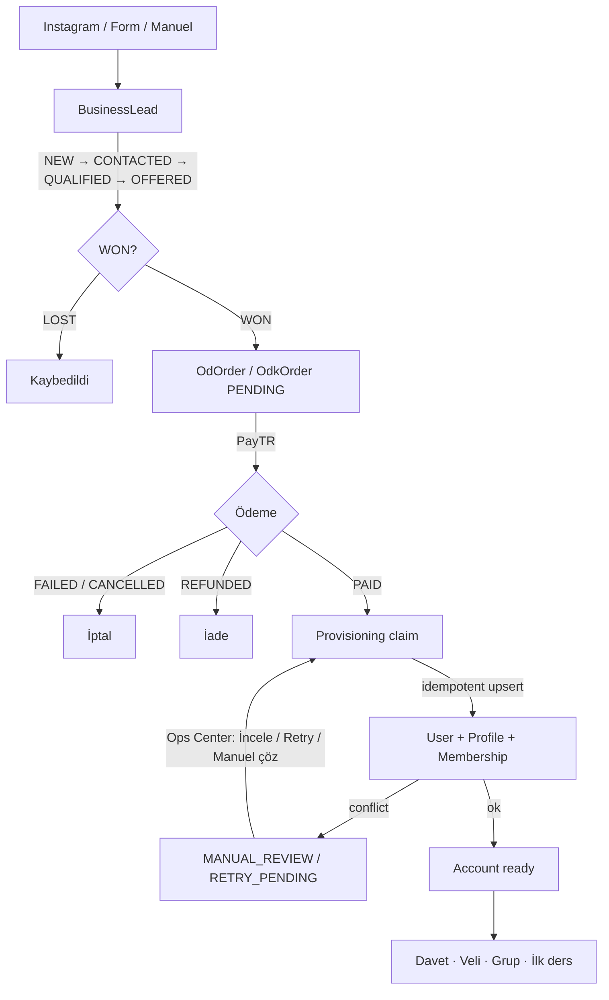

# Lead → Student lifecycle (Part 8)

İşletme paneli (CRM) ile eğitim operasyon paneli arasında
**Lead → Sale/Order → Payment → Provisioning → Student** zinciri tek yaşam
döngüsü olarak izlenir. Yeni Prisma enum üretilmez; mevcut alanlar view
katmanında eşlenir.

## Durum haritası (mevcut enum → ürün dili)

| Ürün dili | Kaynak |
| --- | --- |
| Lead `NEW…WON/LOST` | `LeadStage` (`OFFERED` ← `OFFER_SENT` / `PAYMENT_PENDING`) |
| Order `PAYMENT_PENDING…REFUNDED` | `OdkOrderStatus` (`PENDING` → payment pending) |
| Provisioning `PENDING…NEEDS_REVIEW` | `OdProvisioningStatus` / `OdkProvisioningStatus` (`SUCCEEDED`→COMPLETED, `RETRY_PENDING`→FAILED, `MANUAL_REVIEW`→NEEDS_REVIEW) |
| Student `ACCOUNT_CREATED…READY` | Kullanıcı + davet + membership + grup sinyallerinden türetilir (`OdOnboardingState` varsa öncelikli) |

Kod: `lib/lifecycle/states.ts`

## Akış diyagramı

## Lead detay timeline

`/panel/yonetim/isletme/adaylar?lead=` gerçek eventlerden timeline üretir:

Instagram mesajı → Lead oluşturuldu → Görüşme → Teklif → WON → Sipariş → Ödeme → Provisioning → Öğrenci hesabı

Kaynaklar: `LeadActivity`, konuşma ilk mesajı, bağlı OD/ODK sipariş + ödeme + provisioning.

## WON ve duplicate koruması

- WON aşamasında e-posta + telefon + mevcut user yüksek güvende otomatik bağlanır (`lib/lifecycle/identity.ts` + `leadMatchConfidence`).
- Zayıf eşleşme yalnız öneri; rol/status çatışması `BLOCK`.
- Manuel bağ: `linkLeadLifecycle` → audit `lead.lifecycle.user_linked` / `lead.lifecycle.manual_override`.

## Provisioning

- OD: `provisionOdOrder` — ODK: `provisionOdkOrder`
- Atomik claim + upsert → ikinci öğrenci / entitlement / parent link oluşmaz
- Retry: PayTR callback yeniden denemesi veya Admin sipariş ekranı / Ops Center
- Hata rehberi: `provisioningErrorGuidance` (e-posta conflict, paket, ödeme tutarsızlığı…)

## Operations Center

Provisioning kuyruğu OD **ve** ODK siparişlerini kapsar.

Aksiyon CTA:

- İncele
- Retry
- Manuel çöz

## Audit

| Olay | Action |
| --- | --- |
| Lead WON | `lead.lifecycle.won` |
| Provisioning retry | `order.provisioning.retry` |
| Kullanıcı eşleştirme | `lead.lifecycle.user_linked` / `order.user_linked` |
| Manuel override | `lead.lifecycle.manual_override` |

## Metrikler (dashboard-ready)

`lib/lifecycle/metrics.ts` + `loadLifecycleFunnelMetrics`:

- lead → qualified
- qualified → won
- won → paid
- paid → provisioned
- provision süresi (p50)
- failed provisioning oranı

## Testler

`lib/lifecycle/lifecycle.test.ts`:

- normal sale timeline
- existing user match
- retry / failed provisioning guidance
- duplicate payment event tekilleştirme
- cancelled / refunded map
- manual link activity
- funnel metrics

Mevcut E2E: `tests/e2e/od-payment-provisioning.spec.ts`, `odk-payment-provisioning.spec.ts` (duplicate webhook / idempotency).
